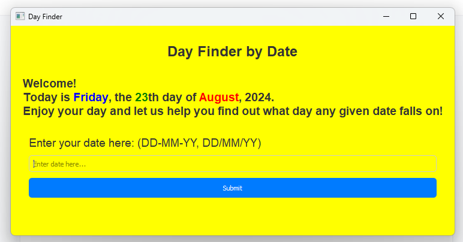

<body>
    <h1>Day Finder</h1>

  
<strong>Day Finder</strong> is a simple and intuitive application that helps you find out the day of the week for any given date. Just enter a date in the format DD-MM-YY or DD/MM/YY, and click "Submit" to see which day of the week it falls on.

  <h2>Features</h2>
    <ul>
        <li><strong>Date Input:</strong> Enter a date in DD-MM-YY or DD/MM/YY format.</li>
        <li><strong>Day Display:</strong> View the day of the week corresponding to the entered date.</li>
    </ul>

  <h2>Installation</h2>
    <ol>
        <li><strong>Clone the Repository:</strong>
            <pre><code>git clone https://github.com/mskstelios/Python-DateViewer.git</code></pre>
        </li>
        <li><strong>Navigate to the Project Directory:</strong>
            <pre><code>cd Python-DateViewer</code></pre>
        </li>
        <li><strong>Install Dependencies:</strong>
            Ensure you have <code>PyQt5</code> installed. You can install it using pip:
            <pre><code>pip install PyQt5</code></pre>
        </li>
        <li><strong>Run the Application:</strong>
            Run the application by executing the following command:
            <pre><code>python date_viewer.py</code></pre>
        </li>
    </ol>

   <h2>Usage</h2>
    <ol>
        <li><strong>Open the Application:</strong>
            Launch the application using the command above.
        </li>
        <li><strong>Enter a Date:</strong>
            In the "Enter your date here:" field, input a date in either DD-MM-YY or DD/MM/YY format.
        </li>
        <li><strong>Submit the Date:</strong>
            Click the "Submit" button to see the day of the week for the entered date.
        </li>
        <li><strong>View Results:</strong>
            The application will display the day of the week below the input field.
        </li>
        <li><strong>Information:</strong>
            An information dialog will be shown when the application starts, providing details about its functionality.
        </li>
    </ol>

   <h2>Screenshots</h2>
        

  <h2>License</h2>
    
This project is licensed under the MIT License - see the <a href="LICENSE">LICENSE</a> file for details.

  

    
Feel free to contact me if you have any questions or need further assistance.

    
Happy day finding!

</body>
</html>

